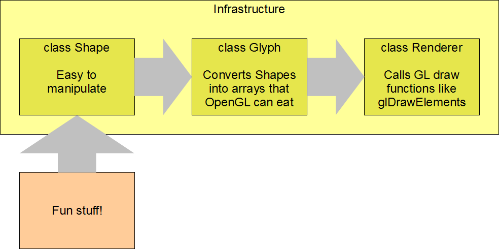
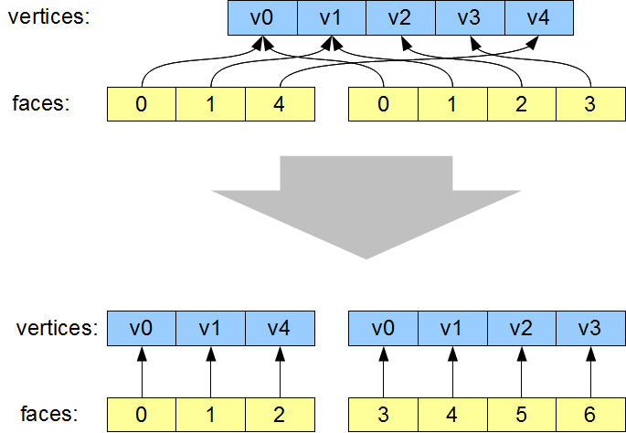
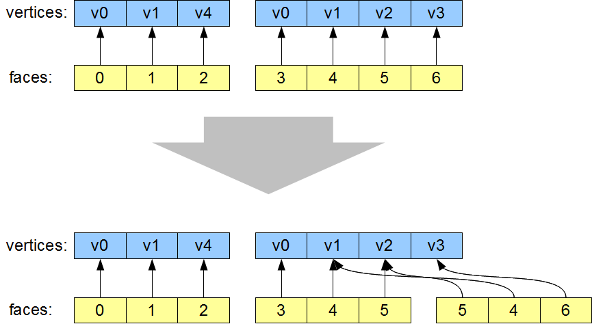
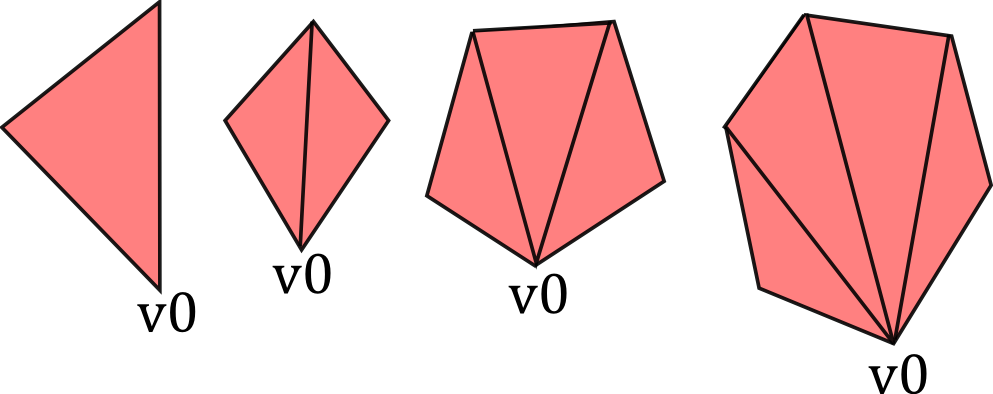
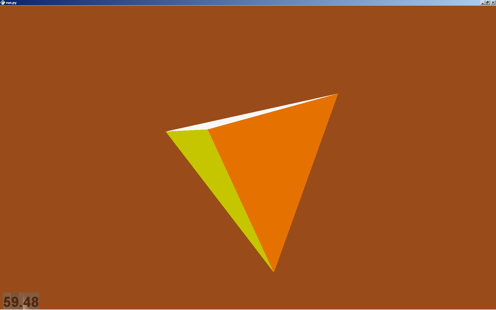
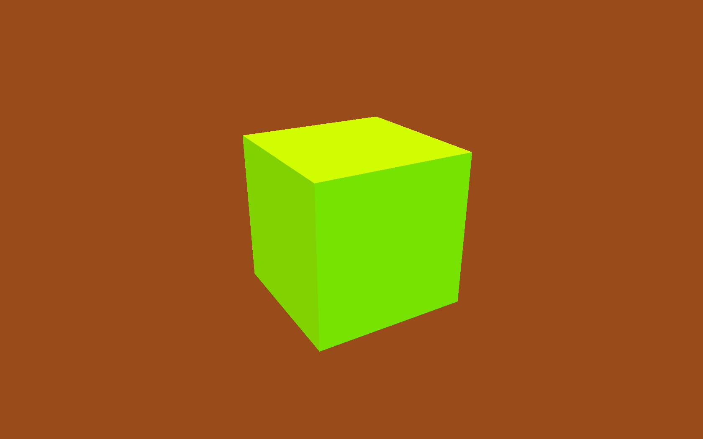

Flying High: Hobbyist OpenGL from Python
========================================

Jonathan Hartley

http://code.google.com/p/flyinghigh-opengl-from-python

.. class:: handout

    Intro

    Hey. Right off the bat I should say that the OpenGL code I'm talking about
    doesn't display very well on any of the projectors.

    You'll have to peer very closely, or take my word for it, to see that these
    animations run fine on the little laptop screen here. My graphics hardware
    has always been flaky when connected to projectors.

    So that's a little disappointing. But I've got lots of screenshots, and
    I'll wave the laptop screen at you to peer at a couple of times, and of
    course you're welcome to grab the code. Search google code for
    'flyinghigh', all one word, and it's the only result.

Inspiratons
-----------

.. class:: handout

    TODO, images:
    * Rez
    * Tron (with 'bit')
    * Love
    * AAAaaaAAAaaAAAA
    * RunJesusRun
    * that FPS that is black and white with red bits
    * Demoscene

    As the field of computer graphics advances, there is an understandable
    tendency to strive for more photorealism, This is laudable and inevitable,
    but I also feel that the effort expended on achieving this technical goal
    is often undertaken without considering whether photorealism is the best
    aesthetic choice for a particular project.

    In particular, the kind of minimal, clean-lined aesthetic that amateaur
    OpenGL programs tend towards are useful for their crisp precision, as
    visualisation tools. But above that, I love them for their austere beauty,
    and I wish more game developers had the balls to voluntarily restrict
    themselves to more traditional vintage vector-graphics.

    In the past, games and other applications were non-photorealistic by
    neccesity. This resulted in a set of distinctive visual styles.

    Modern projects which pro-actively choose a particular aesthetic style,
    whether in emulation of a retro look, or striking out in a new direction of
    their own, are often more distinctive, artistically succesful and memorable
    than any project which merely strives for photorealism. Programs like these
    are my inspiration.

    The demoscene in particular is relevant to this talk, because one of my
    other inspirations has been to create some pretty geometry just for the
    sake of it. As a sculptor might put it, exploring the nature of space.

    All of the examples we'll see in this talk run at 60fps on my 2005-era
    laptop with rubbish graphics hardware (ATI Radeon X1400.)

Starting Point
--------------

Assume we already have a minimal OpenGL application:

* Open a window
* Provide an OpenGL context
* Set an appropriate 3D projection matrix
* Set a modelview matrix for a moveable 3D camera
* Call an empty 'draw' function at 60fps

*Code count: 150 lines*

.. class:: handout

    I'm assuming we're starting with a simple, vanilla OpenGL application, that
    will [do the list above.]
    I'm using pyglet for this, but this would work equally well from pygame, or
    simply with PyOpenGL along with some utility library to create the window
    and context.

    Whichever framework or library you use, this minimal application takes
    about 150 lines or so. This results in a blank screen, redrawn at 60fps.

Screenshot
----------

.. image:: images/blank.png
    :width: 1175
    :height: 775

.. class:: handout

    The idea of this talk is that I will show (or at least describe) *all* of
    the code you need to add on top of this minimal OpenGL loop. I want to
    demonstrate that producing chunky retro graphics is easy, and can be
    done with with a surprisingly small amount of code. I want you to leave
    here enthused to generate your own virtual sculptures or animations or
    games.
    

Goal
----

.. image:: images/goal.png

.. class:: handout

    To begin with, I'm going to lead you as quickly as I can through a couple
    of classes that take some shapes defined in a useful way, and convert them
    in to OpenGL calls.

Goal
----

.. class:: handout

    The point of all this, though, is that once that infrastructure is in
    place, we can have some fun generating fun and interesting shapes to make
    pretty pictures with. In particular, I'm interested in how we can maximise
    our fun with a minimum amount of code.

Modelling Polyhedra
-------------------

.. sourcecode:: python

    Vec3 = namedtuple('Vec3', 'x y z')

    class Shape(object):

      def __init__(self, verts, faces, colors):
        # list of Vec3s
        self.vertices = verts

        # list of faces, each face a list of
        # indices into 'vertices'
        self.faces = faces

        # List of (r, g, b, a) colors,
        # one per face
        self.face_colors = colors

.. class:: handout

    A polyhedron is a 3D shape with flat faces and straight edges. You can 
    see this is a really simple class to model one. So instances of this
    class might represent a particular cube, or teapot shape, or whatever.

Simple Example
--------------

.. image:: images/triangle-square.png
    :width: 600

Instance of Shape
-----------------

.. sourcecode:: python

        RED = (255, 0, 0, 255)
        YELLOW = (255, 255, 0, 255)
        shape = Shape(
            vertices=[
                ( 1,  1, 0), # v0
                ( 1, -1, 0), # v1
                (-1, -1, 0), # v2
                (-1   1, 0), # v3
                ( 1,  0, 2), # v4
            ],
            faces=[
                [0, 1, 4],    # f0, triangle
                [0, 1, 2, 3], # f1, square
            ],
            face_colors=[RED, YELLOW],
        )

.. class:: handout

    A simple example is a geometry consisting of a triangle joined to a square:

Create OpenGL arrays
--------------------

.. class:: handout

    In order to render our Shape instance, we need to convert it into a set of
    ctypes arrays that OpenGL will eat.

Step 1: Dereference the indices to produce a new vertex list in the order
in which they will need to be drawn.

.. class:: handout

    The first step in this conversion is to dereference the indices to
    produce a new list of vertices, which are now sorted into the order
    in which they are going to be drawn. Note that this introduces
    redundancies into the vertex array. For example, position v0 now
    occurs twice in the vertex list.

Glyph Class
-----------

Glyph.get_glverts() performs this defererincing.

.. sourcecode:: python

    def glarray(datatype, length, data):
      return (datatype * length)(* data)

    class Glyph(object):

      def get_glverts(self, shape, num_glverts):
        glverts = chain.from_iterable(
          shape.vertices[index]
          for face in shape.faces
          for index in face
        )
      return glarray(
        GLfloat, num_glverts * 4, glverts)

Create glIndices array
----------------------

Step 2: Modify the indices to tessellate all faces into triangles.

.. class:: handout

    There are well-known algorithms to tesselate arbitrary polygons. An
    implementation using the GLU library takes about 150 lines of Python. For
    the moment though, too keep things simple, let's restrict outselves just to
    convex faces. This lets us get away with a tessellation algorithm which
    is simply this:

Simple Tessellation
-------------------
    

.. class:: handout

    Here you can see that our poor-man's tessellation algorithm is simply to
    take vertex zero (or any arbitrary vertex) and join it up to all the
    other vertices in the face.

tessellate()
------------

.. sourcecode:: python

    def tessellate(face):
        '''
        Break the given face into triangles.
        e.g. [0, 1, 2, 3, 4] ->
             [[0, 1, 2], [0, 2, 3], [0, 3, 4]]
        Does not work on concave faces.
        '''
        return (
            [face[0], face[i], face[i + 1]]
            for i in xrange(1, len(face) - 1)
        )

.. class:: handout

    This means we can't render shapes with concave faces. But that turns out
    not to be much of a restriction - we can still make concave polyhedra, even
    if their faces are all convex.

Glyph again
-----------

.. sourcecode:: python

    class Glyph(object):

      def from_shape(self, shape):

        self.glverts = self.get_glverts(
            shape.vertices, shape.faces)

        self.glindices = self.get_glindices(
            shape.faces)

        self.glcolors = self.get_glcolors(
            shape.faces, shape.face_colors)

.. class:: handout

    Given the tessellation function, Glyph can now create the index and color
    arrays, in much the same way it created the vertex array.

First Light
-----------

.. class:: handout

    So. It's been a bit of a slog to get here, but finally, we now in a
    position to run this code and get some visuals out.

.. image:: images/screen-triangle-square.png
    :width: 1175
    :height: 775

.. class:: handout

    Hooray, we can see our red triangle and yellow square. \o/

Code size check
---------------

Now we have a minimal infrastructure in place.

*Code size: 320 lines*

Shape Factories
---------------

Now let's use our infrastructure for some fun!

.. sourcecode:: python

    def Tetrahedron(edge, face_colors):
        size = edge / sqrt(2)/2
        verts = [
            (+size, +size, +size),   # v0
            (-size, -size, +size),   # v1
            (-size, +size, -size),   # v2
            (+size, -size, -size), ] # v3
        faces = [
            [0, 2, 1],  # f0
            [1, 3, 0],  # f1
            [2, 3, 1],  # f2
            [0, 3, 2] ] # f3
        return Shape(verts, faces, face_colors)

Tetrahedron
-----------

Cube
----

.. sourcecode:: python

    def Cube(edge, face_colors=None):
        e2 = edge/2
        verts = [
            (-e2, -e2, -e2), (-e2, -e2, +e2), (-e2, +e2, -e2), (-e2, +e2, +e2),
            (+e2, -e2, -e2), (+e2, -e2, +e2), (+e2, +e2, -e2), (+e2, +e2, +e2),
        ]
        faces = [
            [0, 1, 3, 2], # left
            [4, 6, 7, 5], # right
            [7, 3, 1, 5], # front
            [0, 2, 6, 4], # back
            [3, 7, 6, 2], # top
            [1, 0, 4, 5], # bottom
        ]
        return Shape(verts, faces, face_colors)

.. class:: handout

    Here we see the eight vertices of a cube, and its six faces.

Cube
----

Demo, some solids.

Moving Shapes
-------------

.. sourcecode:: python

    class Orbit(object):

        def __init__(self, distance, speed, phase=None):
            self.distance = distance
            self.speed = speed
            if phase is None:
                phase = uniformr(0, 2 * pi)
            self.phase = phase

        def __call__(self, time):
            bearing = sin(time * self.speed + self.phase)
            x1 = self.distance * sin(bearing)
            z1 = self.distance * cos(bearing)
            return Vec3(x2, y2, z2)

.. class:: handout

    I've already sneakily added a class to move items around in the world, I'm
    currently using it to move the camera around. We can add an instance of
    this or similar classes to any item. If it's attached as the item's 'mover'
    attribute, then it will be used to move the item around in the world.
    Here we see an example of 'orbit', which will orbit the origin. You
    can imagine more complex move behaviours, the one I attached to the camera
    is called WobblyOrbit

Composite shapes
----------------

