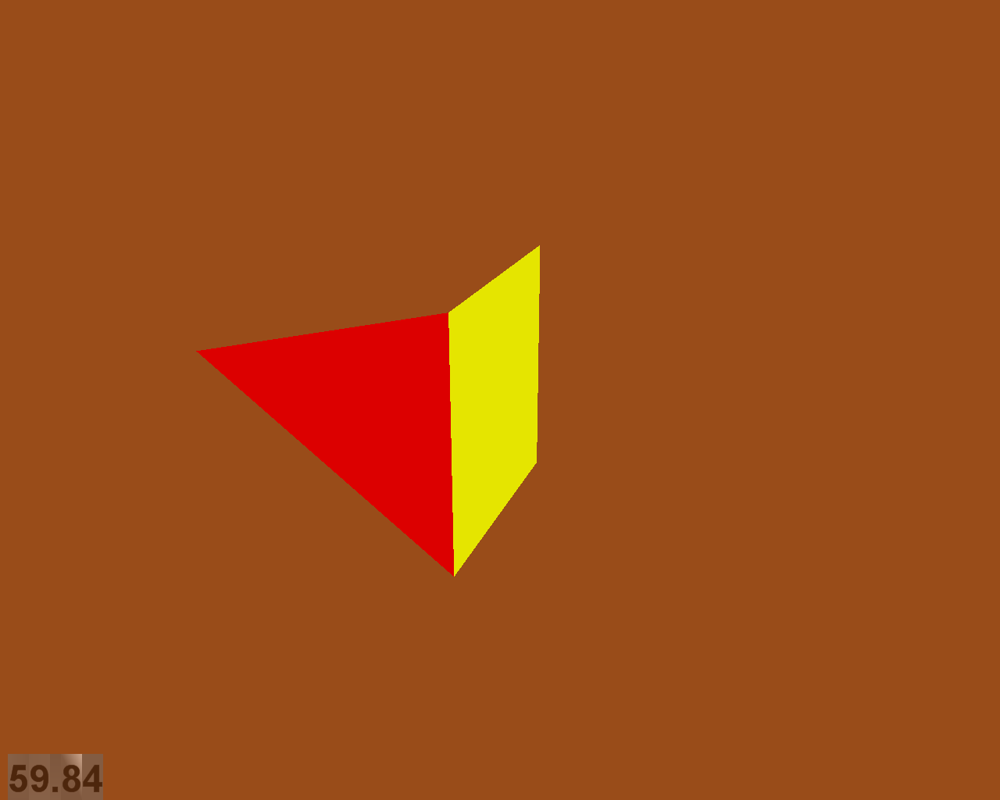

Flying High: Hobbyist OpenGL from Python
========================================

Jonathan Hartley

Intro
-----

Hey. Right off the bat I should say that the OpenGL applications I'm talking
about don't display very well on any of the projectors. I'll throw some
animations up on the big screen, but they look significantly corrupted.
You'll have to peer very closely, or take my word for it, to see that they
run fine on the little laptop screen here. I think my graphics hardware has
always been flaky connected to projectors.

Inspiratons
-----------

As the field of computer graphics advances, there is an understandable
tendency to strive for more photorealism, This is laudable and inevitable,
but I also feel that the effort expended on achieving this technical goal
is often undertaken without considering whether photorealism is the best
aesthetic choice for a particular project.

In particular, the kind of minimal, clean-lined aesthetic that amateaur
OpenGL programs tend towards are useful for their crisp precision, as
visualisation tools. But above that, I love them for their austere beauty,
and I wish more game developers had the balls to voluntarily restrict
themselves to more traditional vintage vector-graphics.

In the past, games and other applications were non-photorealistic by
neccesity. This resulted in a set of distinctive visual styles.

* Rez
* Tron (with 'bit')

    Modern projects which pro-actively choose a particular aesthetic style,
    whether in emulation of a retro look, or striking out in a new direction of
    their own, are often more distinctive, artistically succesful and memorable
    than any project which merely strives for photorealism. Programs like these
    are my inspiration.

* Love
* AAAaaaAAAaaAAAA
* RunJesusRun
* that FPS that is black and white with red bits
* Demoscene

The demoscene in particular is relevant to this talk, because one of my other
inspirations has been to create some pretty geometry just for the sake of it.
As a sculptor might put it, exploring the nature of space.

All of the examples we'll see in this talk run at 60fps on my 2005-era laptop 
with rubbish graphics hardware (ATI Radeon X1400.)

Starting Point
--------------

I'm assuming we're starting with a simple, vanilla OpenGL application, that
will:

* open a window
* provide an OpenGL context
* set an appropriate 3D projection matrix
* call our 'World.update()' every frame
* call our 'Render.draw(world)' after that

I'm using pyglet for this, but this would work equally well from pygame, or
simply with PyOpenGL along with some utility library to create the window and
context.

Whichever framework or library you use, this minimal application takes about
100 lines or so. This results in a blank screen, redrawn at 60fps.

The idea of this talk is that I will show (or at least mention) *all* of the
code you need to add on top of this minimal OpenGL loop. I want to demonstrate
that producing pretty graphics is quite easy, and can be done with a
surprisingly small amount of code. I want you to leave here enthused to
generate your own virtual sculptures and animations, and maybe build on that to
produce simple but effective graphics engines for games.

Modelling Polyhedra
-------------------

Where a Polyhedron is a 3D shape with flat faces and straight edges.

We can model this using a simple class:

.. sourcecode:: python

    Vec3 = namedtuple('Vec3Base', 'x y z')

    class Shape(object):
        '''
        e.g.
        v0 = Vec3(x0, y0, z0)
        v1 = Vec3(x1, y1, z1)
        v2 = Vec3(x2, y2, z2)
        vertices = [ v0, v1, v2... ]
        faces = [ [0, 1, 2], [2, 1, 3]... ]
        face_colors = [ c0, c1... ]
        '''
        def __init__(self, vertices, faces, face_colors):
            self.vertices = vertices
            self.faces = faces
            self.face_colors = face_colors

Vertices is a list of (x, y, z) named tuples.
Each face is a list of indices into the vertex list.
Each face has a corresponding color, as (r, g, b, a) tuples.

A simple example is a geometry consisting of a triangle joined to a square:

.. sourcecode:: python

        RED = (255, 0, 0, 255)
        YELLOW = (255, 255, 0, 255)
        shape = Shape(
            vertices=[
                ( 1,  1,   0), # v0
                ( 1, -1,   0), # v1
                (-1, -1,   0), # v2
                (-1   1,   0), # v3
                ( 1,  0.5, 2), # v4
            ],
            faces=[ [0, 1, 4], [0, 1, 2, 3], ],
            face_colors=[RED, YELLOW],
        )

TODO: diagram of wireframe, showing how shape relates to the geometry

OpenGL Arrays
-------------

In order for OpenGL to render it, our Shape instance needs converting into
a set of ctypes arrays.

* TODO Diagram of our tetrahedron and opengl arrays: vertices, indices, colors

    wireframe, showing vertices but not faces

    vertices = [ v0, v1, v2, v3, v4, ]
    faces = [ [0, 1, 4], [0, 1, 2, 3], ]
    ->
    verttype = GLfloat * 12
    glvertices = verttype( v0, v1, v4, v0, v1, v2, v3, )

So firstly, we need to generate the array of vertex positions.

For the contents of glvertices array, we need to 
dereference the indices in the shape's faces list, to produce the sequence of
vertices in the order in which OpenGL should draw them. Note that this
introduces redundant vertex positions - for example v0 now occurs twice in
glvertices. This redundancy is necessary whenever any attribute of the vertex
differs from one use of it to the next. In this case, it is the color of the
two instances of v0 which is different, depending on whether we are using it
to draw the red triangle or the yellow square.

Even if the colors were the same, the redundant vertex
position is still necessary, because other attributes of the vertex, such as
the vertex normals we'll introduce later, will still differ.

So in short, don't worry about these redundant vertex positions, they are
required.

That was a lot of talk, but the code is quite small.

.. sourcecode:: python

    def glarray(datatype, length, data):
      return (datatype * length)(* data)

    class Glyph(object):

      def get_glverts(self, shape, num_glverts):
        glverts = chain.from_iterable(
          shape.vertices[index]
          for face in shape.faces
          for index in face
        )
      return glarray(GLfloat, num_glverts * 4, glverts)

So the Glyph class converts our Shape instance into a vertex array that
OpenGL can use.

Before we can actually render this vertex array though, there are two other
arrays we also need. We add methods appropriate methods to Glyph:

.. sourcecode:: python

    get_glvertices()
    get_glindices()
    get_glcolors()

Each of these are similar to get_glvertices shown above, but with
their own wrinkles. The output of get_glindices, in particular, looks like
this:

.. sourcecode:: python

    glvertices = verttype( v0, v1, v4, v0, v1, v2, v3, )
    glindices = indextype( 0, 1, 2,  3, 4, 5,  5, 4, 6 )
                           -------   -----------------
                          triangle    square, tessellated

The glindices for the triangular face are straightforward. Something strange
has happened to the indices for the square face though: It now consists of six
indices instead of four. This is because we are passing geometry to OpenGL as
GL_TRIANGLES, and so all faces of greater than three vertices need to be broken
into separate triangles passing them to OpenGL.

There are well-known algorithms to tesselate arbitrary polygons.
An implementation I wrote using the GLU library takes about 150 lines of Python
For the moment though, too keep things simple, let's restrict outselves just to
convex faces. This lets us tesselate faces using a substantially simpler
algorithm: Just take one arbitrarily-chosen vertex, and join it up to all the
other vertices in the face::

    TODO: diagram of simple tesselation algorithm
          doesn't work for concave faces

The code to do this is really simple:

.. sourcecode:: python

    def tessellate(face):
        '''
        Return the given face broken into a list of triangles, wound in the
        same direction as the original poly. Does not work on concave faces.
        e.g. [0, 1, 2, 3, 4] -> [[0, 1, 2], [0, 2, 3], [0, 3, 4]]
        '''
        return (
            [face[0], face[index], face[index + 1]]
            for index in xrange(1, len(face) - 1)
        )

This means we can't render shapes with concave faces. But that turns out not
to be much of a restriction:

    TODO: diagram:
        Can't do polygons with concave faces
        But concave polyhedra using only concave faces are OK
        And if we really need to, we can manually conpose concave faces out of
        several convex faces.

So now we have a simple tesselator, we can implement gl_getindices. It's a lot
like get_glvertices we saw earlier. Once that's done, and our Glyph class
provides vertex, index and color arrays, we're finally ready to to do some
rendering.

Rendering
---------

.. class:: handout

    Now we have generated our vertex and normal arrays, we can pass them to
    OpenGL for rendering! So our renderer class, which handles window.draw
    events, contains standard OpenGL code, to set the MODELVIEW matrix
    depending on the position of the object and call glDrawArrays on the arrays
    we created:

.. sourcecode:: python

    VERT_LEN = 3
    COLOR_LEN = 4
    glVertexPointer(VERT_LEN, GL_FLOAT, 0,
        glyph.glvertices)
    glColorPointer(COLOR_LEN, GL_UNSIGNED_BYTE, 0,
        glyph.glcolors)
    glDrawElements(
        GL_TRIANGLES,
        len(glyph.glindices),
        type_to_enum[glyph.glindex_type],
        glyph.glindices)

This code is standard OpenGL boilerplate. There are cleverer ways of rendering
in OpenGL, but this is pretty standard.

First Light
-----------

.. class:: handout

    So. It's been a bit of a slog to get here, but finally, we now in a
    position to run this code and get some visuals out.

Our camera class 

Shape Factories
---------------

So, now we can start creating simple factory functions to create basic shapes:

.. sourcecode:: python

    def Tetrahedron(edge, face_colors):
        size = edge / sqrt(2)/2
        vertices = [
            (+size, +size, +size),   # v0
            (-size, -size, +size),   # v1
            (-size, +size, -size),   # v2
            (+size, -size, -size), ] # v3
        faces = [
            [0, 2, 1],  # f0
            [1, 3, 0],  # f1
            [2, 3, 1],  # f2
            [0, 3, 2] ] # f3
        return Shape(vertices, faces, face_colors)

TODO: diagram of a tetrahedron. Label vertices, faces.

Cube
----

.. class:: handout

    Or we can create a cube.

.. sourcecode:: python

    def Cube(edge, face_colors=None):
        e2 = edge/2
        verts = [
            (-e2, -e2, -e2), (-e2, -e2, +e2), (-e2, +e2, -e2), (-e2, +e2, +e2),
            (+e2, -e2, -e2), (+e2, -e2, +e2), (+e2, +e2, -e2), (+e2, +e2, +e2),
        ]
        faces = [
            [0, 1, 3, 2], # left
            [4, 6, 7, 5], # right
            [7, 3, 1, 5], # front
            [0, 2, 6, 4], # back
            [3, 7, 6, 2], # top
            [1, 0, 4, 5], # bottom
        ]
        return Shape(verts, faces, face_colors)

.. class:: handout

    TODO: a bunch of different shapes: platonic solids, elite ships

Using Shaders
-------------

